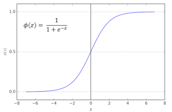
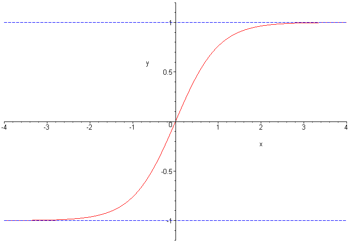

# Representation

Each neural network has the following layers:
- an input layer
- a number of hidden layers
- an output layer

A 2-layer neural network has 1 hidden layer and 1 output layer (the input layer is normally not counted in this terminology)

The super-script $[0]$ represents the layer, in this case 0 denotes the input layer, 1 denotes the hidden layer and 2 denotes the output layer.

The sub-script represents the respective nodes in a layer.

So $a_1^{[1]}$ would represent the first node in the first hidden layer.

# Node calculation

## Vectorizing for a single sample
Using matrix multiplication, we can calculate the value of each of our node.

We know that each hidden node is calculated as the linear transformation of all the values in the previous layer's nodes:
- $z_k^{[j]} = \sum w_k^{[j]T} * x_{j-1} + b_k^{[j]}$
- $a = \sigma(z)$

where:
- $x$ is the input features of size $n \text{ x } 1$
- $w$ is the set of parameters associated with each feature of size $n \text{ x } 1$
- $b$ is the bias, a scalar.
- $\sigma$ is the sigmoid function which is used as the activation function
- $a$ is the activation result
- $k$ is the node index
- $[j]$ is the layer index

## Example

In the two-layer neural network above, the first value of the first layer works out to be:

$ z_1^{[1]} = \sum w_1^{[1]T} * x + b_1^{[1]}$
$ a_1^{[1]} = \sigma(z_1^{[1]})$

Here is the rest of the node values in layer 1:

After we have the first layer, the second layer (output layer) is calculated as the results of the activation values in the first layer:

$ z_1^{[2]} = \sum w_1^{[2]T} * a^{[1]} + b_1^{[2]}$
$ a_1^{[2]} = \sigma(z_1^{[2]})$

## Vectorizing for multiple samples

If we stack up all the samples, we have:
- an input feature matrix X of size $n \text{ x } m$
- a parameter matrix W of size $k^{[i]} \text { x } n$, which consists of the transposed parameters
- bias matrix B of size $k^{[i]} \text{ x } 1$, which will be broadcasted to m columns

where
- $n$ is the number of features
- $m$ is the number of samples
- $k^{[i]}$ is the number of nodes in the i layer

$
X = \begin{bmatrix}
  x_1 \\
  x_2 \\
  ... \\
  x_n
\end{bmatrix}
$, $
W = \begin{bmatrix}
  w_1^T \\
  w_2^T \\
  ... \\
  w_n^T
  \end{bmatrix}
$, $
B = \begin{bmatrix}
  b_1 \\
  b_2 \\
  ... \\
  b_n
\end{bmatrix}
$, $
A = \sigma(Z)
$

Using that, we can derive a general linear combination of these matrices:

- First layer: $ Z^{[1]} = W^{[1]}X + B^{[1]} $  ,  $ A^{[1]} = \sigma(Z^{[1]}) $
- Second layer onward: $ Z^{[i]} = W^{[i]}A^{[i-1]} + B^{[i]} $  ,  $ A^{[i]} = \sigma(Z^{[i]}) $

# Activation Function

A good activation function helps facilitate faster learning.

## Intuition

Without an activation function, a neural network is no more expressive than a logistics regression.

Recall that:

$a^{[1]} = w^{[1]}x+b^{[1]}$
$a^{[2]} = w^{[2]}a^{[1]}+b^{[2]}$

If there is no activation function, then

$a^{[2]} = w^{[2]} * (w^{[1]}x + b^{[1]}) + b^{[2]} = w^{[1]}w^{[2]}x + w^{[2]}b^{[1]}+b^{[2]} = w'x + b'$, which is another linear function of x

So essentially, all we are doing over and over again is to calculate a linear transformation of $x$.

## Choices
- Sigmoid: $a = \frac{1}{1+e^{-z}}$

- TanH: $a = \frac{e^z - e^{-z}}{e^z + e^{-z}}$

TanH is superior to sigmoid because it has the effect of centering data. Except in the case of binary classification because we naturally need output of 0 or 1.

The downsides of TanH and sigmoid is that when z is either really big or small is that the gradient gets close to 0 and that makes learning slow (vanishing gradient). For that reason, Rectified Linear Unit (ReLU) has become a popular alternative.

- ReLU: $a = max(0, z)$

- Leaky ReLU is another variant where when z < 0, the derivative is not 0 so learning is kept alive. It isn't used as much in practice because the value of z is normally positive.

## Rule of thumb:
1. Use sigmoid for binary classification
2. Use ReLU for everything else

# Backpropagation

The goal of back-propagation is to determine the value  $\frac{\delta L}{\delta w}$ so that we can adjust the weight of each node.

We cannot do this until we know the final derivative $\frac{\delta L_l}{\delta a^{[l]}}$. That's why this method is called back-propagation. We calculate the final derivative of the loss function and pass this value back progressively to calculate the gradient of the weight at each node.

## Approach

Our goal is to adjust the weights to reach the optimal value of the loss function. With gradient descent, we need to know $\frac{\delta L}{\delta w^n}$, which is a measure of how much a change in $\textbf{w}$ would affect $\textbf{L}$.

We know that:

$$
	z^n = a^{n-1} \cdot w^n
$$

Taking the partial derivative with respect to $w^n$ and $a^{n-1}$ give us:

$$
	\frac{\delta z^n}{\delta a^{n-1}} = w^n,
	\frac{\delta z^n}{\delta w^{n}} = a^{n-1}
$$

The procedure to back propagate is:

1. Input X. Since this is the first layer, set the first activations $a^1$ to be the same as the input data.
2. Initialize the weights. A quick, easy way is sampling from the standard normal.
3. Feed forward. For each of the layer n, compute
	$$
		\text{Pre-activated value}: z^n = a^{n-1} \cdot w^n
  $$
  $$
		\text{Activated value}: a^n = \sigma (z^n)
	$$
4. When the forward pass reaches its last layer, calculate the error of L with regards to last pre-activated node $z^L$
	$$
		\frac{\delta L}{\delta z^L} = \frac{\delta L}{\delta a^L} \frac{\delta a^L}{\delta z^L} = \frac{\delta L}{\delta a^L} \sigma'(z^L)
	$$
5. Back propagate error. For each layer n going backward, compute the product of the local gradient and the propagated gradient:
	$$
		\frac{\delta L}{\delta z^n} = \frac{\delta L}{\delta z^{n+1}} \frac{\delta z^{n+1}}{\delta a^{n}} \frac{\delta a^n}{\delta z^n} = \frac{\delta L}{\delta z^{n+1}} * w^n * \sigma'(z^n)
	$$
6. Calculate gradient of loss with respect to weight:
	$$
		\frac{\delta L}{\delta w^n} = \frac{\delta L}{\delta z^n} \frac{\delta z^n}{\delta w^n}
	$$
7. Adjust the weight:
	$$
		w^n = w^n - \alpha \frac{\delta L}{\delta w^n}
	$$

## Example

Let's back-propagate for a two-layer neural network with the first activation being tanh and the final activation being sigmoid.

Our final products are the derivative for the set of weights $\frac{\delta L}{\delta w^{[2]}}$ and $\frac{\delta L}{\delta w^{[1]}}$

First, calculate $dz2 = \frac{\delta L}{\delta z^{[2]}} = \frac{\delta L}{\delta a^{[2]}} * \frac{\delta a^{[2]}}{\delta z^{[2]}}$

- $\frac{\delta L}{\delta a^{[2]}} = \frac{\delta}{\delta a} -(ylog(1-a) + (1-y)log(1-a)) = \frac{1-y}{1-a} - \frac{y}{a}$

- $\frac{\delta a^{[2]}}{\delta z^{[2]}} = \frac{\delta}{\delta z} \frac{1}{1+e^{-z}} = -\frac{1}{(1 + e^{-z})^2} * -e^{-z} = \frac{1}{1+e^{-z}} * \frac{e^{-z}}{1 + e^{-z}} = a(1-a) $

- $\frac{\delta L}{\delta z^{[2]}} = \frac{1-y}{1-a} - \frac{y}{a} * a(1-a) = a - y $

Next, calculate $\frac{\delta L}{\delta w^{[2]}} =  \frac{\delta L}{\delta z^{[2]}} * \frac{\delta z^{[2]}}{\delta w^{[2]}}$

- $\frac{\delta z^{[2]}}{\delta w^{[2]}} = \frac{\delta}{\delta w} w^{[2]T}a^{[1]} + b = a^{[1]T} $

- $\frac{\delta L}{\delta w^{[2]}} = dz2 * a^{[1]T} * 1$

We repeat the process for $\frac{\delta L}{\delta w^{[1]}}$

First, calculate $dz1 = \frac{\delta L}{\delta z^{[1]}} = \frac{\delta L}{\delta z^{[2]}} * \frac{\delta z^{[2]}}{\delta a^{[1]}} * \frac{\delta a^{[1]}}{\delta z^{[1]}}$

- $\frac{\delta z^{[2]}}{\delta a^{[1]}} =  \frac{\delta}{\delta w} w^{[2]T}a^{[1]} + b = a^{[1]T} = w^{[2]T}  $

- $\frac{\delta a^{[1]}}{\delta z^{[1]}} = 1 - a^2$ (this is the derivative of the tanh function)

- $\frac{\delta L}{\delta z^{[1]}} = dz2 * w^{[2]T} * (1-a^2)$

Next, calculate $\frac{\delta L}{\delta w^{[1]}} =  \frac{\delta L}{\delta z^{[1]}} * \frac{\delta z^{[1]}}{\delta w^{[1]}}$

- $\frac{\delta z^{[1]}}{\delta w^{[1]}} = \frac{\delta}{\delta w} w^{[1]T}x + b = x^T $

- $\frac{\delta L}{\delta w^{[2]}} = dz1 * x^T$

The scalar gradients are simply:

- $\frac{\delta L}{\delta b^{[2]}} = dz2$
- $\frac{\delta L}{\delta b^{[1]}} = dz1$
